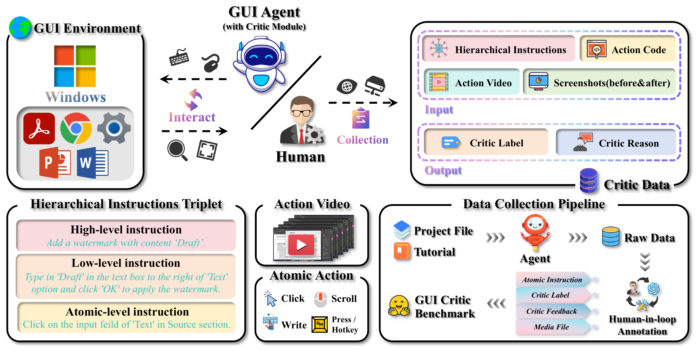
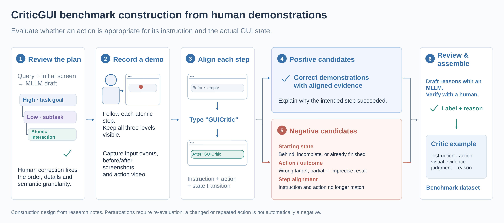

# CriticGUI

**Can a multimodal model tell whether a GUI action actually worked—and explain why?**

CriticGUI studies state-aware, instruction-grounded evaluation of GUI actions. A critic receives a hierarchical instruction, action code and visual evidence, and returns a success/failure judgment with a reason.

[Project blog](https://kaiming-y.github.io/blog/criticgui/) · [WorldGUI agent](https://github.com/showlab/WorldGUI) · [WorldGUI website](https://showlab.github.io/WorldGUI/)



## What this repository provides

The main release is a **human-demonstration collection toolkit**, organized from the original GUICritic research code:

- A provider-independent prompt for drafting a plan with an MLLM, followed by manual refinement.
- Strict parsing of a **three-level** plan: high-level milestone → low-level subtask → atomic interaction.
- Step-by-step desktop recording with all three instructions visible in the terminal, mouse/keyboard logs, before/after screenshots and OBS video.
- Separate recording variants for deliberate mistakes, manual critic-label/reason annotation, and portable JSONL export.
- The original action parsing, normalization and PyAutoGUI-code translation utilities, with release fixes and offline tests.

For **agent exploration**, use the [Plan-Act-Critic agent in WorldGUI](https://github.com/showlab/WorldGUI). Agent trajectories and human demonstrations are complementary sources for critic evaluation. This release does not bundle the full WorldGUI runtime, an automatic WorldGUI-log importer, or the complete benchmark dataset.

## Why human demonstrations?

Agent-only collection inherits the capabilities and exploration biases of the executing MLLM. Difficult tasks can fail before the agent reaches the states we want a critic to judge. This limits the diversity and complexity of the collected examples, and can couple evaluation too closely to the behavior of the collection model.

Human demonstrations let us reach these otherwise underrepresented states and control the granularity of each interaction. Deliberate, human-recorded perturbations then provide difficult contrasts: a wrong target, incorrect text, or a missing confirmation can look superficially plausible but fail the current instruction. Agent-generated examples remain useful; human collection broadens what they cover.


## Collection workflow



The diagram summarizes the research design, including model-assisted reasons and candidate perturbations. The released CLI records and exports human-reviewed attempts; it does not automatically generate all illustrated augmentations.

1. **Draft:** give an MLLM the user query and initial screenshot, optionally with a tutorial video/transcript. Generate a proposed plan.
2. **Refine and freeze:** a human corrects ordering and UI details, splits non-atomic steps, and fixes the three-level hierarchy. A draft becomes a ground-truth plan only after review.
3. **Demonstrate:** restore the intended starting state, then execute and record each atomic instruction. The recorder displays its high- and low-level context as well.
4. **Perturb:** restore the relevant pre-action state, deliberately alter the execution and record a separate variant. The intended instruction stays the same; the deviation is documented. This is a manual process, not an automatic corruption algorithm.
5. **Review and package:** inspect the evidence, assign a judgment and reason, then export reviewed examples. The name `negative-*` records intent, not a guaranteed failure label.

An atomic interaction is **semantically minimal**, not necessarily a single hardware event. Typing text may contain many key presses. The original code calls the middle layer `low-level`; the finest layer is explicitly `atomic-level`.

## Quick start

Python **3.10+** is recommended. Plan validation, action processing and tests use the Python standard library. Live recording additionally needs a graphical desktop, input/screenshot permissions, and **OBS Studio with its WebSocket server enabled**. The original research environment was Windows; live recording in this reorganized release has not yet been validated end-to-end on Windows or macOS.

```bash
python -m venv .venv
# Activate .venv using your shell's activation command.
pip install -r requirements.txt
```

Configure OBS to capture the intended desktop/app. Prefer MKV output, use a local OBS server and set `OBS_HOST`, `OBS_PORT` and `OBS_PASSWORD` in your environment (see [.env.example](.env.example)). The recorder copies only the exact video path returned by OBS when that recording stops; it does not move unrelated videos.

### 1. Draft and review the plan

```bash
python -m human_demo.plan.draft_prompt --software "Adobe Acrobat" --query "Add my signature above Signature of Student" --output local/prompt.txt
```

Submit the prompt plus the initial screenshot to your chosen MLLM. Save its response as `local/draft-plan.txt`, review it and save the corrected procedure as `local/plan.txt`. The release deliberately leaves the model provider to you; it does not make API calls or include credentials.

See [examples/plan.txt](examples/plan.txt) for the format:

```text
h0: Add a signature to the document.
l0: Create the signature text.
a0: Click the signature text field.
a1: Type GUICritic into the signature text field.
a2: Click the Apply button to confirm the signature.
l1: Place the signature at the required location.
a0: Click above the Signature of Student label to place the signature.
```

This example assumes the signature dialog is already open. Adapt it to your initial state.

```bash
python -m human_demo.plan.parse_plan local/plan.txt --output local/plan.json
```

The parser rejects missing parents, empty groups and duplicate IDs. It checks structure, **not whether the plan is correct in the application**.

### 2. Record each atomic instruction

Open the task file yourself and prepare the initial state before recording:

```bash
python -m human_demo.action_record --plan local/plan.json --output recordings --task-id AA09 --software "Adobe Acrobat"
```

| Shortcut | Action |
| --- | --- |
| Ctrl + Shift + F12 | Start the current atomic recording |
| Ctrl + Shift + F11 | Stop it and save evidence |
| Ctrl + Shift + F10 | Skip an instruction while waiting |

The terminal displays `HIGH`, `LOW` and `ATOMIC` content (stored as `high-level`, `low-level`, `atomic-level`). Completed steps are skipped on restart. A plan hash prevents silently resuming with a changed plan. Restore the application's state yourself when resuming or skipping; the recorder does not replay previous steps.

### 3. Record a controlled negative variant

Restore the state immediately before the target step. Execute a deliberate deviation while recording:

```bash
python -m human_demo.action_record --plan local/plan.json --output recordings --task-id AA09 --software "Adobe Acrobat" --variant negative-wrong-target --step h0l0a0
```

Variants use separate folders, preserving the original demonstration. Use a new variant name for a new attempt. Neither the folder name nor a failed intent substitutes for judging the observed result.

### 4. Review the outcome

```bash
python -m human_demo.annotate recordings/AA09/positive/h0l0a0 --label success --reason "The signature field has focus, as indicated by its caret." --reviewer r01
python -m human_demo.annotate recordings/AA09/negative-wrong-target/h0l0a0 --label failure --reason "Focus moved to another control; the signature field remains inactive." --perturbation "Clicked the adjacent control instead of the signature field" --parent-uid AA09_positive_h0l0a0 --reviewer r01
```

These are illustrative reasons; write the reason supported by your actual recording. Review `before.png`, `after.png` and the video before labeling. New annotations do not overwrite old ones unless `--overwrite` is passed.

### 5. Export reviewed examples

```bash
python -m human_demo.action_process --input recordings --output exports/reviewed
```

Only completed, annotated recordings are exported. Each example contains the three instructions, source metadata, normalized actions, action-code text, visual evidence paths and the human judgment/reason. Export generates code as text; it does **not** execute it. Use a new or empty export directory.

See [docs/data-format.md](docs/data-format.md) for the structure and [docs/agent-exploration.md](docs/agent-exploration.md) for how the WorldGUI collection path fits alongside human demonstrations.

## Scope and limitations

- This is a collection toolkit, not a trained critic or an automatic benchmark scorer.
- Human plan review, state restoration, perturbation design and final annotation remain manual.
- Heuristic action parsing can misgroup unusual shortcuts, IME/non-Latin typing, drags or app-specific interactions. Review the normalized actions against the video. Generated PyAutoGUI code is not a verified replay script.
- Screenshots capture the primary screen with PyAutoGUI. Configure OBS to capture the same display and keep resolution/scaling consistent. Input-event timestamps and video do not yet have a calibrated frame-level synchronization mechanism.
- The release saves explicit before/after screenshots and the complete action video; intermediate frames can be inspected in the video. It does not reproduce the old asynchronous screenshot-per-event collector.
- Recording failures leave incomplete captures for inspection and do not mark the step complete.
- Use a clean task environment: recordings contain screen content and typed text. No collected user sessions, API keys or model weights are included in this repository.

## Validation and provenance

```bash
python -m unittest discover -s tests -v
python -m compileall -q human_demo
```

Offline tests cover three-level parsing, stale-parent/duplicate rejection, log parsing, generated-text escaping and reviewed-only export with media paths. These tests do not establish live OBS/desktop compatibility.

CriticGUI was my undergraduate final-year project at [NUS (Chongqing) Research Institute](https://en.nusricq.cn/). This publication copy retains the reusable action parser and normalizer from the original GUICritic code and adds a portable collection workflow. The [WorldGUI repository](https://github.com/showlab/WorldGUI) is the reference for the agent branch. See [docs/release-notes.md](docs/release-notes.md) for the distinction between original research code and release changes.
